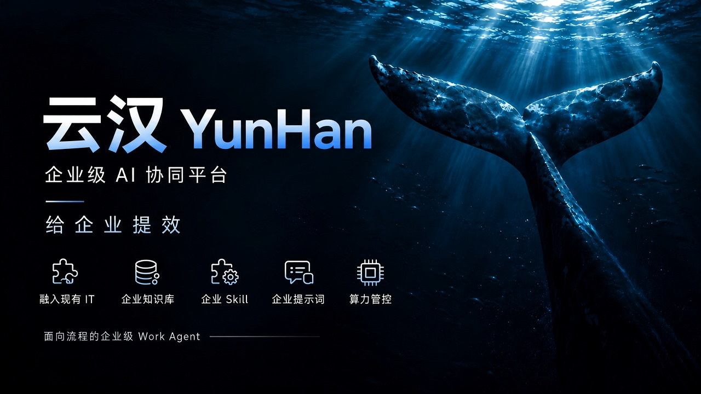

<p align="center"></p>

# YunHan · Enterprise AI Collaboration Platform

<h1 align="center">YunHan</h1>

<p align="center"><strong>The process-oriented enterprise Work Agent — productivity for the enterprise, not just the individual</strong><br/>Built on the <a href="https://github.com/deepseek-ai/deepseek-harness">DeepSeek Harness</a> everything-is-a-plugin agent framework and standard BPMN</p>

<p align="center"><a href="LICENSE"></a><a href="https://github.com/deepseek-ai/deepseek-harness"></a><a href="https://bpmn.io"></a><a href="https://www.flowable.com"></a><a href="https://spring.io/projects/spring-boot"></a></p>

***

English | [中文](README.zh.md)

## Personal productivity ≠ enterprise productivity

Today's Work Agent platforms — WorkBuddy, Codex, Claude, Qianwen Office, Doubao Office — are all doing the same thing: making individuals faster. YunHan **adds enterprise properties to mainstream Work Agent technology**. Personal knowledge bases become an enterprise knowledge base; personal skills become enterprise skills with centralized management, traceable versions and dynamic upgrades; personal prompts become enterprise prompts bound to process nodes and governed with process versions; personal tokens become enterprise compute with unified authorization and accounting — and industry-standard BPMN wires AI into the IT and processes the enterprise already runs. In one sentence: **YunHan is not a Work Agent that speeds up personal office work; it is a process-oriented Work Agent that makes the enterprise productive.**

## Four enterprise-grade capabilities

### 1. Enterprise properties for the Work Agent

| Personal Work Agent                                                                  | YunHan enterprise Work Agent                                                                                          |
| ------------------------------------------------------------------------------------ | --------------------------------------------------------------------------------------------------------------------- |
| Knowledge bases scattered across personal machines and chat history                  | Enterprise knowledge base: centralized libraries, per-app authorization, three-way hybrid retrieval (vector + keyword + full-text) + Rerank re-scoring |
| Skills installed in personal directories, everyone on their own version              | Enterprise skill repository: centralized management, traceable versions, per-app binding, dynamic delivery to employee clients and AI nodes |
| Prompts kept in personal favorites, each person with their own wording               | Enterprise prompts: bound to BPMN nodes, versioned and released with the process definition, one consistent standard for everyone |
| Tokens spent individually, nobody can account for the total                          | Enterprise compute: unified access, quota configuration, per-person and per-app accounting and analytics               |

### 2. Standard BPMN integrates with existing IT — no rebuild required

At its core sits Flowable 7 (the BPMN 2.0 industry standard), with custom extensions that weave AI natively into the canvas: single approvals, countersigning, sequential signing, voting-based completion such as "pass when 3 of 5 approve", automatic timeout reminders and escalation, and SoD segregation of duties — all out of the box. AI nodes and human nodes reach enterprise legacy systems (System of Record: expense control, ERP, etc.) through service keys, and process outputs are written straight back into those systems — the latest AI working methods land on traditional enterprise IT as integration, not reconstruction.

### 3. Industry-standard authentication and authorization

SSO single sign-on (Supabase OIDC; all three services verify JWTs locally with JWKS, no shared secrets); matrix authorization based on departments and roles; SoD segregation of duties; every governance operation lands in the audit log. Zero cloud dependency beyond authentication — process instances, governance metadata and knowledge-base vectors all live in the enterprise's own local PostgreSQL and never leave the intranet.

### 4. Unified authorization, monitoring and management of enterprise token compute

Multiple model providers connect through one API gateway; quotas are configured per person and per app; usage analytics provide a year-long consumption heatmap and per-call ledgers; every AI call inside a process (full prompt, response, token usage) is recorded for review — every unit of enterprise compute is accountable.

## Capability overview

| Capability                    | Description                                                                                                                 |
| ----------------------------- | --------------------------------------------------------------------------------------------------------------------------- |
| Visual process designer       | bpmn-js graphical designer with a fully Chinese properties panel; node validation, publishing and instance launching in one place |
| AI backend nodes              | A resident server-side agent service executes automatically: prompt interpolation, skill references, JSON output mapped back into the process context, multi-instance parallelism supported |
| Human nodes + AI collaboration | Employees open a todo and enter an AI conversation; once the result is confirmed they submit it in one click following the output mapping, and structured records drive the process |
| Voting-based countersigning   | The step completes automatically when pass/reject votes reach the threshold; remaining todos are cleaned up                  |
| Process context               | Typed variable declarations + node output mappings + dotted-path references; gateway conditions, AI nodes and human nodes share one dataset |
| Instance monitoring and replay | Historic activity paths highlighted on the canvas; two-way linkage between the log table and the diagram; every AI call on the record |
| Process analytics             | Node duration heatmaps (fast/medium/slow), per-handler duration rankings, slowest-node rankings, timeout boundary-event statistics |
| Enterprise knowledge base     | Vector + keyword + full-text three-way retrieval, RRF fusion + Rerank re-scoring, ready for AI nodes out of the box          |
| LLM governance                | Model access, quota configuration, usage analytics (heatmap + ledger), statistics per person and per app                    |
| Organization governance       | Departments, users, apps, roles, members and skill repository bindings, with full audit-log coverage                         |

## A quick tour

### Employee client: a personal workspace that runs enterprise processes

Employees log into the DSH desktop client: todos on the left, an AI conversation area in the middle to complete the task, and a task summary panel on the right showing process progress (highlighted execution path) and per-node logs in real time.


### Process designer: drag out human-AI hybrid processes

In the graphical BPMN designer, "User Tasks" (human) and "DSH Backend Tasks" (AI) sit side by side on one canvas; the Chinese properties panel on the right configures candidate roles, completion conditions, output mappings and more, and one click publishes after validation passes.


### Node-level AI orchestration: enterprise prompts + enterprise skills + output mappings

AI nodes and human nodes share one orchestration model: `{{variables}}` interpolate the process context inside prompts, skills are referenced from the enterprise skill repository as needed, and output mappings are declared as a JSON skeleton; multi-instance nodes can bind multiple backend instances to run in parallel.

| AI backend node                                                                    | Human node (User Task)                                        |
| ---------------------------------------------------------------------------------- | ------------------------------------------------------------- |
|  |  |

### Instance replay: every AI call is on the record

The instance detail page replays historic activity paths highlighted on the canvas; clicking a log row locates the node on the diagram, and every backend-node call records the full prompt submitted and the response returned.


### Process analytics: bottlenecks from the enterprise perspective

Nodes are automatically split into fast/medium/slow duration heatmaps, together with per-handler duration rankings and slowest-node rankings — bottlenecks and timeout hot spots are obvious at a glance. This end-to-end perspective is exactly what a personal Work Agent cannot give you.


### Enterprise knowledge base: let AI read the company's documents

Libraries are created per app and organized into folders; uploaded documents are parsed, chunked and embedded automatically (parse status visible in real time); retrieval combines vector, keyword and full-text three-way recall with RRF fusion and Rerank re-scoring — ready for AI nodes and employee conversations out of the box.


### Token compute dashboard: every unit of consumption accounted for

The LLM management menu centralizes model access, quota configuration and usage analytics: a year-long consumption heatmap shows trends at a glance, and the call ledger records the user, model, billing source, input/output tokens and overage for every call — enterprise compute turns from a black-box expense into an accountable asset.


### Departments and authorization: the skeleton of matrix permissions

A platform-level department tree manages organizational membership; authorization inside each app is role-based. Candidate roles in processes and data visibility are all driven by this department + role matrix, with SoD segregation of duties and full auditing.


### App governance: members, roles, skills on one page

Each app independently manages members and roles (department + role matrix authorization), bound skill repositories (traceable versions), process definitions and knowledge bases, and every governance operation enters the audit log.

| Users and roles                                                 | Skill binding                                                |
| --------------------------------------------------------------- | ------------------------------------------------------------ |
|  |  |

## Architecture

[](docs/diagrams/dsh-enterprise-platform.html)

The three services (employee client, management console, process engine) each verify JWTs locally with Supabase JWKS — no shared secrets; beyond authentication, all data lives in the enterprise's own local PostgreSQL and never leaves the intranet. Employee browsers always reach server services through the local DSH webserver proxy, never directly. New business systems are attached to processes one by one following the SOR integration pattern (service key + whitelisted endpoints).

## Quick start

### Prerequisites

- Node.js ^22.19 or >=24, pnpm
- Java 17+ and Maven (process engine and management console)
- A local PostgreSQL (with the pgvector, pg\_trgm and pg\_jieba extensions)
- A Supabase project (for authentication JWT signing + knowledge-base file storage only)
- An LLM API key (DeepSeek or any OpenAI-compatible provider)

### Start

```sh
pnpm install
pnpm run build

# 1) Process engine (:8090, creates the ACT_* tables automatically on first start)
cd apps/flowable-engine && mvn spring-boot:run

# 2) Management console (:8080, frontend bundled into the same jar)
cd apps/web-console && mvn spring-boot:run

# 3) Employee client DSH (:3080)
pnpm dsh --profile enterprise
```

### Environment variables

| Environment variable                                                      | Employee | flowable-engine | web-console | Description                                            |
| ------------------------------------------------------------------------- | :------: | :-------------: | :---------: | ------------------------------------------------------ |
| `SUPABASE_URL`                                                            |    ✓     |        ✓        |      ✓      | Supabase project URL (authentication + storage only)   |
| `SUPABASE_ANON_KEY`                                                       |    ✓     |        —        |      ✓      | Supabase anon key                                      |
| `SUPABASE_DB_HOST` / `_USER` / `_PASSWORD`                                |    —     |        ✓        |      ✓      | Local PostgreSQL connection                            |
| `FLOWABLE_ENGINE_URL` / `FLOWABLE_BASE_URL`                               |    ✓     |        —        |      ✓      | Engine address (employee client uses the former, console the latter) |
| `WEB_CONSOLE_URL`                                                         |    ✓     |        ✓        |      —      | Console address (default `http://127.0.0.1:8080`)      |
| `DSH_SERVICE_KEY`                                                         |    —     |        ✓        |      ✓      | Service key for intranet service-to-service access to knowledge-base read-only endpoints; identical on both sides |
| `SKILLHUB_BASE_URL` / `SKILLHUB_API_TOKEN`                                |    ✓     |        —        |      ✓      | Enterprise skill repository (default `http://127.0.0.1:8095`) |
| `KB_EMBEDDING_API_KEY`                                                    |    —     |        —        |      ✓      | Knowledge-base embedding key, required (SiliconFlow by default) |
| `KB_RERANK_API_KEY`                                                       |    —     |        —        |      ✓      | Knowledge-base rerank key, required (SiliconFlow by default) |
| `KB_EMBEDDING_API_URL` / `KB_EMBEDDING_MODEL` / `KB_EMBEDDING_DIMENSIONS` |    —     |        —        |   optional  | embedding provider/model/dimensions (default `Qwen/Qwen3-Embedding-4B`, 2560) |
| `KB_RERANK_API_URL` / `KB_RERANK_MODEL` / `KB_RERANK_MIN_SCORE`           |    —     |        —        |   optional  | rerank provider/model/threshold (default `Qwen/Qwen3-Reranker-8B`, 0.1) |
| `NEWAPI_BASE_URL` / `NEWAPI_SERVICE_TOKEN`                                |    —     |        —        |      ✓      | LLM gateway address and internal service token (default `http://localhost:3000`) |
| `TESSDATA_PATH` / `KB_MAX_UPLOAD_MB`                                      |    —     |        —        |   optional  | OCR language-pack directory / knowledge-base upload limit (default 50MB) |
| `DEEPSEEK_API_KEY` and other standard DSH LLM settings                    |    ✓     |        —        |      —      | Employee-client model key, configured the native DSH way |

The backend node service (`dsh --profile enterprise-backend`) also needs `SUPABASE_URL`, `WEB_CONSOLE_URL` and `DSH_SERVICE_KEY`; its LLM and workspace configuration are independent of the employee client. For table SQL and Supabase configuration see the [Supabase setup guide](docs/plans/2026-08-19-supabase-setup-guide.md) and the [local PostgreSQL setup guide](docs/plans/2026-09-21-local-pg-setup-guide.md).

## Community and co-building

The project is evolving fast. If you are thinking about how AI can truly enter enterprise processes and organizations, or want to bring YunHan to your own business, scan the QR codes to reach us on WeChat or follow us on Douyin; we also offer a companion enterprise AI transformation course and methodology (the full path from super individuals to super teams). If you like the project, a Star and a Follow are the best encouragement.

<table>
  <thead>
    <tr><th align="center">WeChat</th><th align="center">Douyin</th></tr>
  </thead>
  <tbody>
    <tr>
      <td align="center"></td>
      <td align="center"></td>
    </tr>
  </tbody>
</table>

## Acknowledgements

- [DeepSeek Harness](https://github.com/deepseek-ai/deepseek-harness) — the everything-is-a-plugin agent framework YunHan is built on
- [Cordis](https://github.com/cordiverse/cordis) — the plugin runtime
- [Flowable](https://github.com/flowable/flowable-engine) — the BPMN process engine
- [bpmn-js](https://github.com/bpmn-io/bpmn-js) — process modeling and replay
- [Supabase](https://supabase.com) — authentication

## License

[MIT](LICENSE)
