# 云汉 · 企业级 AI 协同平台

<h1 align="center">云汉 YunHan</h1>

<p align="center"><strong>面向流程的组织级 Work Agent —— 给组织提效，而不只是给个人提效</strong><br/>基于 <a href="https://github.com/deepseek-ai/deepseek-harness">DeepSeek Harness</a> 全插件 Agent 框架与标准 BPMN 构建</p>

<p align="center"><a href="LICENSE"></a><a href="https://github.com/deepseek-ai/deepseek-harness"></a><a href="https://bpmn.io"></a><a href="https://www.flowable.com"></a><a href="https://spring.io/projects/spring-boot"></a></p>

***

[中文](README.zh.md) | [English](README.md)

## 个人提效 ≠ 组织提效

今天的 Work Agent 平台——WorkBuddy、Codex、Claude、千问办公、豆包办公——都在做同一件事：让个人更快。云汉**给主流 Work Agent 技术加上企业属性**。个人知识库变成企业知识库，个人 Skill 变成集中管理、版本可控、动态升级的企业 Skill，个人提示词变成绑定在流程节点上、随流程版本治理的企业提示词，个人 Token 变成企业统一授权与核算的算力——再通过行业标准 BPMN 把 AI 编进企业现有的 IT 与流程。一句话：**云汉不是给个人办公提效的 Work Agent，而是面向流程、给企业提效的 Work Agent。**

## 四个企业级能力

### 1. 给 Work Agent 加上企业属性

| 个人 Work Agent        | 云汉企业 Work Agent                                   |
| -------------------- | ------------------------------------------------- |
| 知识库散落在个人电脑与聊天记录      | 企业知识库：集中建库、按应用授权、三路混合检索（向量 + 关键词 + 全文）+ Rerank 精排 |
| Skill 装在个人目录，各装各的版本  | 企业 Skill 仓库：集中管理、版本可追溯、按应用绑定，动态分发到员工端与 AI 节点      |
| 提示词存在个人收藏夹，口径因人而异    | 企业提示词：与 BPMN 节点绑定，随流程定义版本化发布，全员同一口径               |
| Token 各花各的，花了多少没人说得清 | 企业算力：统一接入、额度配置、按人与按应用核算分析                         |

### 2. 标准 BPMN 融入现有 IT，而不是推翻重来

以 Flowable 7（BPMN 2.0 行业标准）为流程核心，用自定义扩展把 AI 原生编进画布：单人审批、会签、串签、按票数收工的会签计票（如「5 人中 3 票同意即通过」）、超时自动提醒与升级、SoD 责权分离，全部开箱即用。AI 节点与人工节点通过服务密钥调用企业 legacy 业务系统（System of Record：费控、ERP 等），流程产出直接写回业务系统——最新的 AI 工作方法落在传统企业 IT 上，是融入，不是重建。

### 3. 兼容行业标准的认证与授权

SSO 单点登录（Supabase OIDC，三端 JWKS 本地验签、无共享密钥）；基于部门与角色的矩阵式授权；SoD 责权分离；全部治理操作进入审计日志。认证之外零云依赖——流程实例、治理元数据、知识库向量全部落在企业自己的本地 PostgreSQL，不出内网。

### 4. 企业 Token 算力统一授权、监控、管理

多模型供应商经API 网关统一接入；额度按人、按应用配置；用量分析提供近一年消耗热力图与逐笔调用明细；流程内每一次 AI 调用（提示词全文、响应、Token 用量）留痕可查——AI 花的每一分钱都对得上账。

## 能力总览

| 能力            | 说明                                                          |
| ------------- | ----------------------------------------------------------- |
| 可视化流程设计器      | bpmn-js 图形设计器 + 全中文属性面板，节点校验、发布、发起新实例一站式完成                  |
| AI 自动节点（后台节点） | 服务器端常驻 Agent 服务自动执行：提示词插值、Skill 引用、JSON 输出映射写回流程上下文，支持多实例并行 |
| 人工节点 + AI 协同  | 员工点开待办即进入 AI 对话，确认结果后按输出映射一键提交，结构化记录驱动流程                    |
| 会签计票          | 按通过/否决票数自动收工，达标即推进，剩余待办自动清理                                 |
| 流程上下文         | 类型化变量声明 + 节点输出映射 + 点路径引用，网关条件、AI 节点、人工节点共用一份数据              |
| 实例监控与回放       | 历史活动路径高亮回放，日志表与画布双向联动，AI 调用全程留痕                             |
| 流程效能分析        | 节点时长热力图（快/中/慢三档）、办理人耗时榜、最慢节点榜、超时边界事件统计                      |
| 企业知识库         | 向量 + 关键词 + 全文三路检索，RRF 融合 + Rerank 精排，AI 节点开箱即用              |
| LLM 治理        | 模型接入、额度配置、用量分析（热力图 + 明细），按人/按应用统计                           |
| 组织治理          | 部门/用户/应用/角色/成员/Skill 仓库绑定，审计日志全覆盖                           |

## 界面速览

### 员工端：个人工作台，承载的是企业流程

员工登录 DSH 桌面端，左侧是待办工作台；中间是与 AI 协作完成任务的对话区；右侧任务摘要面板实时显示流程进度（执行路径高亮）与逐节点日志。

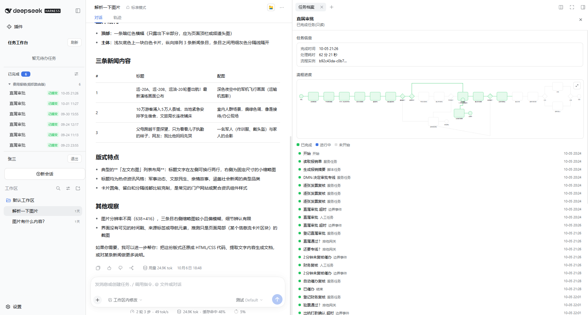

### 流程设计器：拖拽出人机混合流程

图形化 BPMN 设计器中，「用户任务」（人工）与「DSH 后台任务」（AI 自动）平等地摆在一个画布上；右侧中文属性面板配置候选角色、完成条件、输出映射等，校验通过后一键发布。

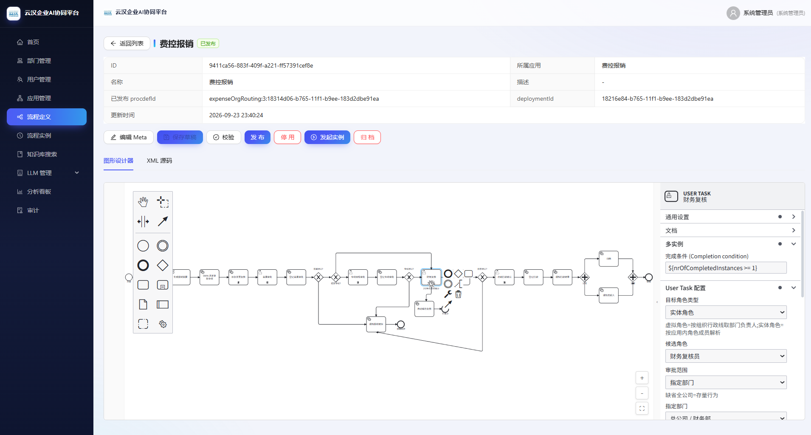

### 节点级 AI 编排：企业提示词 +企业 Skill + 输出映射

AI 自动节点与人工节点共用同一套编排模型：提示词中用 `{{变量}}` 插入流程上下文，按需引用企业 Skill 仓库中的 Skill，并以 JSON 骨架声明输出映射；多实例节点可绑定多个后台实例并行执行。

| AI 自动节点（后台任务）                                                  | 人工节点（用户任务）                                            |
| -------------------------------------------------------------- | ----------------------------------------------------- |
| 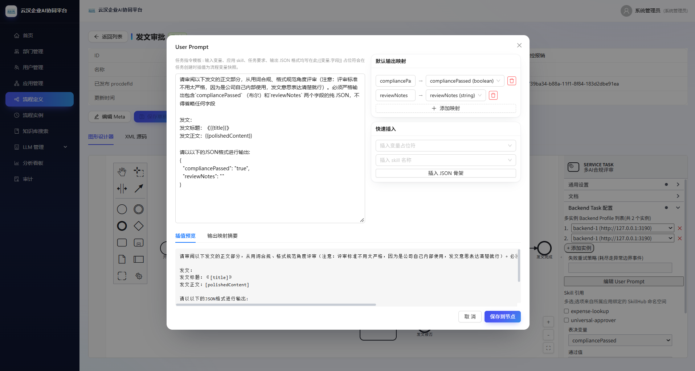 | 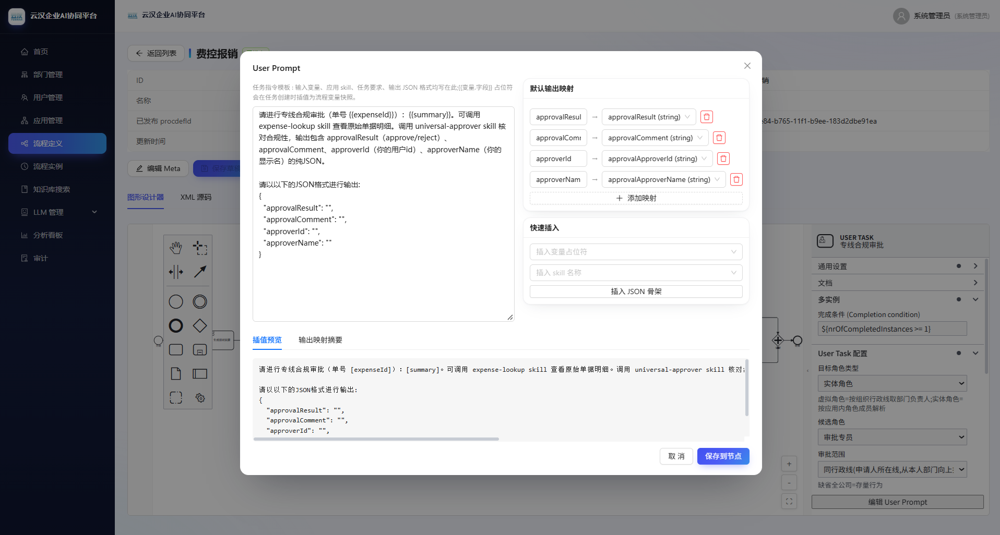 |

### 实例回放：每一步 AI 调用都有据可查

实例详情页将历史活动路径在画布上高亮回放，点击日志行即可反向定位节点；后台节点的每次调用都记录了提交的提示词全文、返回的响应。

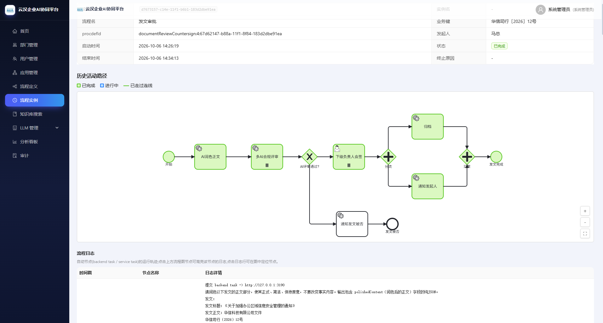

### 效能分析：企业视角看流程瓶颈

节点按时长自动分成快/中/慢三档热力图，配合办理人耗时榜与最慢节点榜，流程瓶颈与超时重灾环节一目了然——这是个人Work Agent给不了的端到端视角。

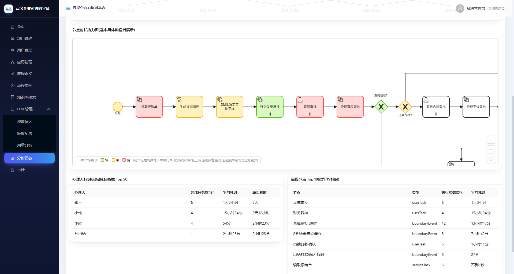

### 企业知识库：让 AI 读企业的文档

按应用建库、按文件夹组织文档，上传后自动解析、分块、向量化（解析状态实时可见）；检索走向量 + 关键词 + 全文三路召回、RRF 融合 + Rerank 精排，AI 节点与员工对话开箱即用。

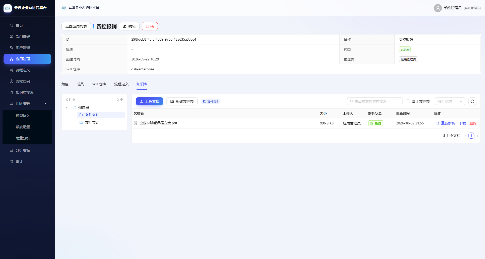

### Token 算力看板：每一笔消耗都对得上账

LLM 管理菜单集中模型接入、额度配置与用量分析：近一年消耗热力图一眼看趋势，调用明细逐笔记录用户、模型、扣费来源、输入/输出 Token 与超额情况——企业算力从黑盒支出变成可核算的资产。

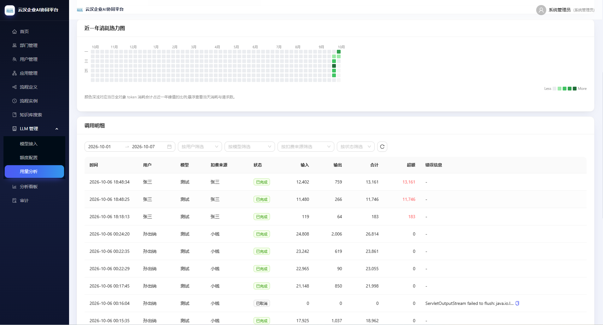

### 部门与授权：矩阵式权限的骨架

平台级部门树统一管理人员组织归属，应用内再按角色授权；流程候选角色、数据可见范围都由这套部门 + 角色的矩阵式授权驱动，配合 SoD 责权分离与全程审计。


### 应用治理：成员、角色、Skill 一页管完

每个应用独立管理成员与角色（部门 + 角色矩阵式授权）、绑定的 Skill 仓库（版本可追溯）、流程定义与知识库，治理操作全部进入审计日志。

| 用户与角色                                    | Skill 绑定                                     |
| ---------------------------------------- | -------------------------------------------- |
| 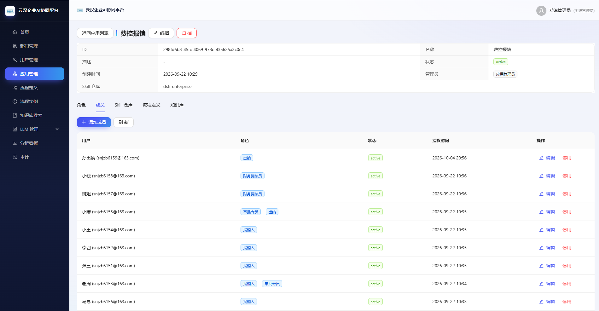 | 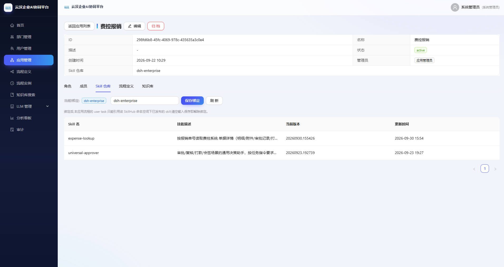 |

## 架构

[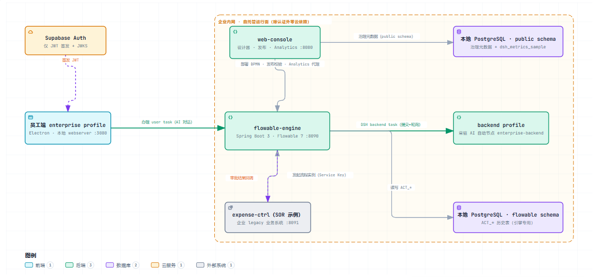](docs/diagrams/dsh-enterprise-platform.html)

三端（员工端、管理控制台、流程引擎）各自用 Supabase JWKS 本地验签 JWT，无共享密钥；认证之外的所有数据都落在企业自己的本地 PostgreSQL，不出内网。员工浏览器访问服务器一律经本地 DSH 服务代理转发，不直连。新业务系统按 SOR 接入范式（服务密钥 + 白名单端点）逐一挂进流程。

## 快速上手

### 环境要求

- Node.js ^22.19 或 >=24，pnpm
- Java 17+ 与 Maven（流程引擎与管理控制台）
- 本地 PostgreSQL（需 pgvector、pg\_trgm、pg\_jieba 扩展）
- 一个 Supabase 项目（仅用于认证签发 JWT + 知识库文件 Storage）
- 一个 LLM API Key（DeepSeek 或任意 OpenAI 兼容供应商）

### 启动

```sh
pnpm install
pnpm run build

# 1) 流程引擎（:8090，首次启动自动建 ACT_* 表）
cd apps/flowable-engine && mvn spring-boot:run

# 2) 管理控制台（:8080，前端已打进同一个 jar）
cd apps/web-console && mvn spring-boot:run

# 3) 员工端 DSH（:3080）
pnpm dsh --profile enterprise
```

### 环境变量

| 环境变量                                                                      | 员工端 | flowable-engine | web-console | 说明                                                     |
| ------------------------------------------------------------------------- | :-: | :-------------: | :---------: | ------------------------------------------------------ |
| `SUPABASE_URL`                                                            |  ✓  |        ✓        |      ✓      | Supabase 项目地址（仅认证 + Storage）                           |
| `SUPABASE_ANON_KEY`                                                       |  ✓  |        —        |      ✓      | Supabase anon key                                      |
| `SUPABASE_DB_HOST` / `_USER` / `_PASSWORD`                                |  —  |        ✓        |      ✓      | 本地 PostgreSQL 连接                                       |
| `FLOWABLE_ENGINE_URL` / `FLOWABLE_BASE_URL`                               |  ✓  |        —        |      ✓      | 引擎地址（员工端用前者，控制台用后者）                                    |
| `WEB_CONSOLE_URL`                                                         |  ✓  |        ✓        |      —      | 控制台地址（默认 `http://127.0.0.1:8080`）                      |
| `DSH_SERVICE_KEY`                                                         |  —  |        ✓        |      ✓      | 服务密钥，内网服务间调用知识库只读端点，两端一致                               |
| `SKILLHUB_BASE_URL` / `SKILLHUB_API_TOKEN`                                |  ✓  |        —        |      ✓      | 组织 Skill 仓库（默认 `http://127.0.0.1:8095`）                |
| `KB_EMBEDDING_API_KEY`                                                    |  —  |        —        |      ✓      | 知识库 embedding 密钥，必填（默认硅基流动）                            |
| `KB_RERANK_API_KEY`                                                       |  —  |        —        |      ✓      | 知识库 rerank 密钥，必填（默认硅基流动）                               |
| `KB_EMBEDDING_API_URL` / `KB_EMBEDDING_MODEL` / `KB_EMBEDDING_DIMENSIONS` |  —  |        —        |      可选     | embedding 供应商/模型/维度（默认 `Qwen/Qwen3-Embedding-4B`、2560） |
| `KB_RERANK_API_URL` / `KB_RERANK_MODEL` / `KB_RERANK_MIN_SCORE`           |  —  |        —        |      可选     | rerank 供应商/模型/阈值（默认 `Qwen/Qwen3-Reranker-8B`、0.1）      |
| `NEWAPI_BASE_URL` / `NEWAPI_SERVICE_TOKEN`                                |  —  |        —        |      ✓      | LLM 网关地址与内部服务令牌（默认 `http://localhost:3000`）            |
| `TESSDATA_PATH` / `KB_MAX_UPLOAD_MB`                                      |  —  |        —        |      可选     | OCR 语言包目录 / 知识库上传上限（默认 50MB）                           |
| `DEEPSEEK_API_KEY` 等 DSH 标准 LLM 配置                                        |  ✓  |        —        |      —      | 员工端模型 Key，DSH 原生配置方式                                   |

后端自动节点服务（`dsh --profile enterprise-backend`）同样需要 `SUPABASE_URL`、`WEB_CONSOLE_URL` 与 `DSH_SERVICE_KEY`；LLM 与工作空间配置独立于员工端。建表 SQL 与 Supabase 配置见 [Supabase 配置手册](docs/plans/2026-08-19-supabase-setup-guide.md) 与 [本地 PG 建库手册](docs/plans/2026-09-21-local-pg-setup-guide.md)。

## 交流与共建

项目仍在快速进化中。如果你在思考「AI 怎么真正进入企业的流程与组织」，或者想把云汉落地到自己的业务上，欢迎扫码加微信交流；我们也提供与之配套的企业 AI 转型课程与落地方法论（从超级个体到超级团队的完整路径）。觉得不错的话，点一个 Star 并 Follow，就是最大的鼓励。

<p align="center"></p>

## 致谢

- [DeepSeek Harness](https://github.com/deepseek-ai/deepseek-harness) — 全插件 Agent 框架底座，云汉构建于其上
- [Cordis](https://github.com/cordiverse/cordis) — 插件化运行时
- [Flowable](https://github.com/flowable/flowable-engine) — BPMN 流程引擎
- [bpmn-js](https://github.com/bpmn-io/bpmn-js) — 流程建模与回放
- [Supabase](https://supabase.com) — 认证服务

## 许可证

[MIT](LICENSE)
